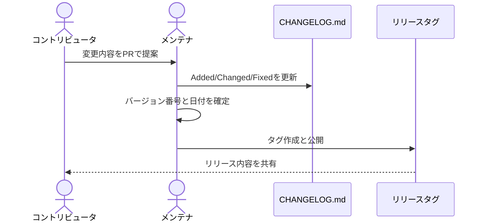

# Changelog

このプロジェクトの重要な変更はすべてこのファイルに記載します。

形式は [Keep a Changelog](https://keepachangelog.com/ja/1.0.0/) に基づき、このプロジェクトは [Semantic Versioning](https://semver.org/lang/ja/) に従います。

## [Unreleased]

### Added

- **画面要求(UIイメージ)セクション**を新規追加(`画面-XX` プレフィックス、画面一覧・画面詳細・代替テキスト記述ルール)
- `assets/screens/<プロジェクト識別子>/` を画面キャプチャ・モックアップの格納ディレクトリとして規定(`_template/` / `saas-feature/` / `order-management/` のサブディレクトリで名前空間を分離)
- `scripts/generate_screen_placeholders.py` でプレースホルダー画像(PNG)を再生成可能に
- トレーサビリティ表に `画面` 列を追加
- `docs/writing-guide.md` に画面要求の書き方とレビュー観点を追加

### Changed

- **Breaking:** 要求IDプレフィックスを日本語化(BR→業務、UC→利用 等)。詳細は README の対応表を参照
- **Breaking:** 画面要求セクション追加に伴い `template.md` の章番号を再採番(旧6章「非機能要求」以降が +1)
- テンプレートにトレーサビリティ・データ要求・リスク・Given-When-Then を追加
- 非機能分類に ISO/IEC 25010 参照注記を追加
- `examples/saas-feature-sample.md` / `examples/order-management-sample.md` に画面要求セクションの記入例を追加
- `CONTRIBUTING.md` の見出しを日本語化
- Markdown 用の `.editorconfig` / `.markdownlint.jsonc` と、GitHub Actions 用 lint ワークフローのサンプル(`docs/samples/github-actions-markdown-lint.yml`)を追加

### Fixed

- 表記ゆれ(スコープ表記・優先度表記)の整理

## [0.1.0] - 2026-05-12

### Added

- MIT ライセンスの公開リポジトリ構成
- `template.md`(11セクションの要求仕様テンプレート)
- `examples/order-management-sample.md` の記入例
- `docs/writing-guide.md`(記述ルールとレビューチェックリスト)
- `LICENSE` (MIT)
- `CONTRIBUTING.md`
- 公開向けに整理した `README.md`

---

## リリース更新の流れ(運用メモ)

