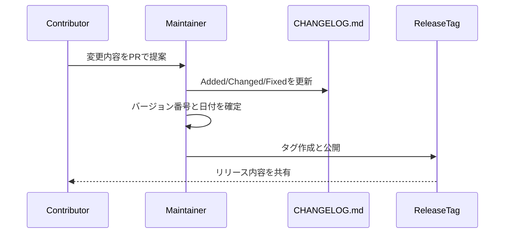

# Changelog

All notable changes to this project are documented in this file.

The format is based on Keep a Changelog, and this project follows Semantic Versioning.

## Release Update Sequence

## [0.1.0] - 2026-05-12

### Added

- Initial public release structure for a MIT-licensed repository
- `template.md` with 11-section requirements-to-spec template
- `examples/order-management-sample.md` as a filled sample
- `docs/writing-guide.md` for writing rules and review checklist
- `LICENSE` (MIT)
- `CONTRIBUTING.md`
- Reworked `README.md` for public GitHub usage
