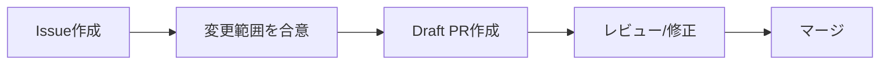
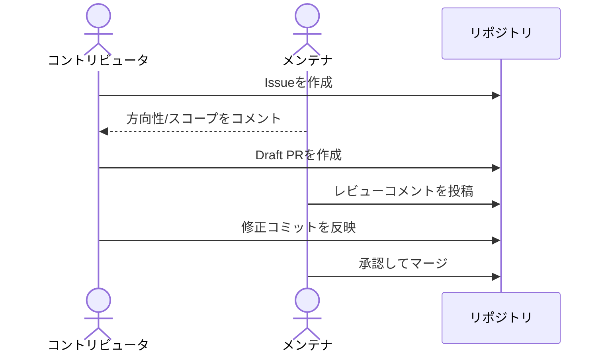

# コントリビューションガイド

このリポジトリへの改善提案・テンプレート拡張・サンプル追加を歓迎します。

## 受け付ける貢献

- `template.md` の改善提案
- `examples/` への記入例追加
- `docs/` の運用ガイド改善
- タイポ修正、表現改善、リンク修正

## 貢献フロー

1. Issue を作成し、背景と目的を共有する
2. 必要に応じて Draft Pull Request を作成する
3. レビューコメントを反映する
4. 合意後にマージする

## Issue 作成時の推奨テンプレート

以下を最低限記載してください。

- 背景:
- 期待する結果:
- 対象ファイル:
- 補足:

## Pull Request 作成時の推奨テンプレート

- 目的:
- 変更点:
- 影響範囲:
- 確認方法:
- 未解決事項:

## 記述ルール

- 仕様は可能な限りテスト可能な文で書く
- あいまいな表現を避ける
- 未確定事項は `未解決-XX` として明記する

詳しくは `docs/writing-guide.md` を参照してください。

## ライセンス

このプロジェクトに対する貢献は、リポジトリの [MIT License](./LICENSE) の条件に従うものとします。
