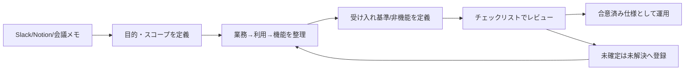
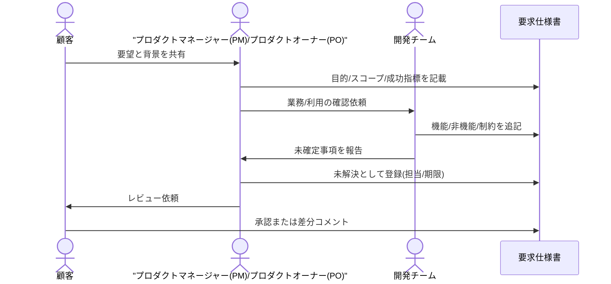

# requirements-to-spec-template

要求を仕様に落とし込むための、GitHub公開向けテンプレート集です。  
会議メモやチャットの断片を、合意可能かつテスト可能な要求仕様書に変換することを目的にしています。

本リポジトリは、以下の記事の考え方を参考に構成しています。  
[要求を仕様に落とすテンプレートを作ってみた](https://zenn.dev/channnnsm/articles/c3a6de22e71f86)

## Quick Start

1. [`template.md`](template.md) をコピーして、対象プロジェクト名と目的を記入する
2. [`examples/order-management-sample.md`](examples/order-management-sample.md) を参照しながら **業務 → 利用 → 機能** の順で埋める
3. [`docs/writing-guide.md`](docs/writing-guide.md) のチェックリストでレビューし、未確定事項は `未解決-XX` に登録する

### 全体フロー図



### 合意形成のシーケンス図



### 5分で試す最小入力例

```text
業務-01: 受注ミスを月20件以下にする
利用-01: 業務担当者が受注CSVを登録する
機能-01: ユーザーがCSVをアップロードしたとき、システムはフォーマットを検証する
```

### 機能要求の書き方サンプル(悪い例 / 良い例)

```text
悪い例: ユーザーがログインできること
良い例: ユーザーがIDとパスワードを入力して「ログイン」を押下したとき、
    システムは認証を実行し、成功時はダッシュボードに遷移する。
    失敗時は「ログイン情報が正しくありません」と表示する。
```

## このリポジトリでできること

- 要求(Why)と要件/仕様(What)を分離して整理する
- **業務 → 利用 → 機能** の階層で要求を構造化する
- 機能を受け入れ基準付きで定義し、テスト可能にする
- 非機能を数値・条件・測定方法で記述する
- 未確定事項を **未解決事項** として運用管理する
- トレーサビリティ表・データ要求・リスクで抜け漏れを減らす

## 対象読者

- 要件定義を標準化したい開発チーム
- 顧客との合意形成に使える仕様書フォーマットが必要なプロダクトマネージャー(PM)/プロダクトオーナー(PO)
- AI実装前に仕様の曖昧さを減らしたいエンジニア

## リポジトリ構成

```text
.
├── README.md
├── template.md
├── assets/
│   └── screens/
│       ├── _template/         # template.md が参照する汎用ワイヤーフレーム
│       ├── saas-feature/      # examples/saas-feature-sample.md 用
│       └── order-management/  # examples/order-management-sample.md 用
├── scripts/
│   └── generate_screen_placeholders.py
├── examples/
│   ├── order-management-sample.md
│   └── saas-feature-sample.md
├── docs/
│   ├── writing-guide.md
│   └── samples/
│       └── github-actions-markdown-lint.yml
├── .github/
│   ├── ISSUE_TEMPLATE/
│   │   ├── bug_report.md
│   │   └── feature_request.md
│   └── pull_request_template.md
├── .editorconfig
├── .markdownlint.jsonc
├── CHANGELOG.md
├── CONTRIBUTING.md
└── LICENSE
```

## サンプル一覧

| ファイル | 内容 |
| --- | --- |
| [`examples/order-management-sample.md`](examples/order-management-sample.md) | 受注CSV取り込みの記入例 |
| [`examples/saas-feature-sample.md`](examples/saas-feature-sample.md) | SaaSの機能追加(共有リンク)の記入例 |

## テンプレート構成(`template.md`)

`template.md` は次のセクションで構成されています。

1. **ID凡例とプレフィックス** — 業務/利用/機能などの接頭辞の意味
2. ドキュメント管理
3. プロジェクト概要(目的・背景・スコープ・成功指標(KPI))
4. ステークホルダー分析
5. 業務要求
6. 利用要求・ユースケース
7. 機能要求(受け入れ基準・Given-When-Then)
8. **画面要求**(UIイメージ・主要要素・遷移)
9. 非機能要求(ISO/IEC 25010 参照注記)
10. 制約条件
11. 外部連携要求
12. 前提条件・依存関係
13. 未解決事項
14. **トレーサビリティ**(業務〜テストの対応表)
15. **データ要求**
16. **リスク**
17. 用語定義
18. 変更履歴

## 使い方

1. `template.md` をコピーして新規要求仕様書を作成する
2. 「目的」「スコープ内/外」「成功指標」を先に確定する
3. **業務 → 利用 → 機能** の順に詳細化する
4. 機能ごとに受け入れ基準をチェック可能な文で記述する
5. 未確定事項は本文に埋めず `未解決-XX` に移し、担当者と期限を設定する
6. トレーサビリティ表・データ要求・リスクを随時更新する

## 運用ガイド

- 記述ルールとレビュー観点: [`docs/writing-guide.md`](docs/writing-guide.md)
- 記入済みサンプル: [`examples/`](examples/)

## 画面プレースホルダーの再生成(任意)

`examples/` に含まれる画面要求のプレースホルダー画像は、`scripts/generate_screen_placeholders.py` で再生成できます。`rsvg-convert`(librsvg)と Noto Sans CJK JP フォントがインストールされている環境で次を実行してください。

```bash
python3 scripts/generate_screen_placeholders.py
```

新規プロジェクトでは、本物のキャプチャ/モックアップ画像を `assets/screens/` に直接配置してください(スクリプトの利用は任意です)。

## 品質チェック(Markdown)

GitHub Actions で PR 時に `markdownlint-cli2` による Markdown 検査を行う場合は、[`docs/samples/github-actions-markdown-lint.yml`](docs/samples/github-actions-markdown-lint.yml) を `.github/workflows/lint.yml` にコピーして有効化してください(Personal Access Token 等で `workflow` スコープが必要な環境があります)。

ローカルでは [markdownlint-cli2](https://github.com/DavidAnson/markdownlint-cli2) をインストールし、リポジトリルートで実行できます。

**任意:** [textlint](https://textlint.github.io/) で技術文書ルールや表記揺れチェックを追加する場合は、チーム方針に合わせて `.textlintrc` を導入してください。

## リリース履歴

- 変更履歴: [CHANGELOG.md](./CHANGELOG.md)

## Issue / PR 運用

- バグ報告: `.github/ISSUE_TEMPLATE/bug_report.md`
- 改善提案: `.github/ISSUE_TEMPLATE/feature_request.md`
- Pull Request: `.github/pull_request_template.md`

## ライセンス

このリポジトリは [MIT License](./LICENSE) で公開しています。

## コントリビューション

改善提案・テンプレート拡張・記入例の追加を歓迎します。  
詳細は [CONTRIBUTING.md](./CONTRIBUTING.md) を参照してください。

## 旧IDから新IDへの対応(破壊的変更)

次リリースで、IDプレフィックスを日本語接頭辞に統一します。詳細は [CHANGELOG.md](./CHANGELOG.md) の `[Unreleased]` を参照してください。

| 旧ID | 新ID |
| --- | --- |
| BR-XX | 業務-XX |
| UC-XX | 利用-XX |
| FR-XX | 機能-XX |
| NFR-XX | 非機能-XX |
| CON-XX | 制約-XX |
| IF-XX | 連携-XX |
| ASM-XX | 前提-XX |
| OI-XX | 未解決-XX |
| UI-XX(新規) | 画面-XX |
| REQ-XXXX | 要件-XXXX |
| Must / Should / Could | 必須 / 推奨 / 任意 |
| Scope IN / Scope OUT | スコープ内 / スコープ外 |
