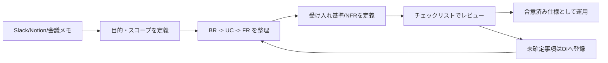
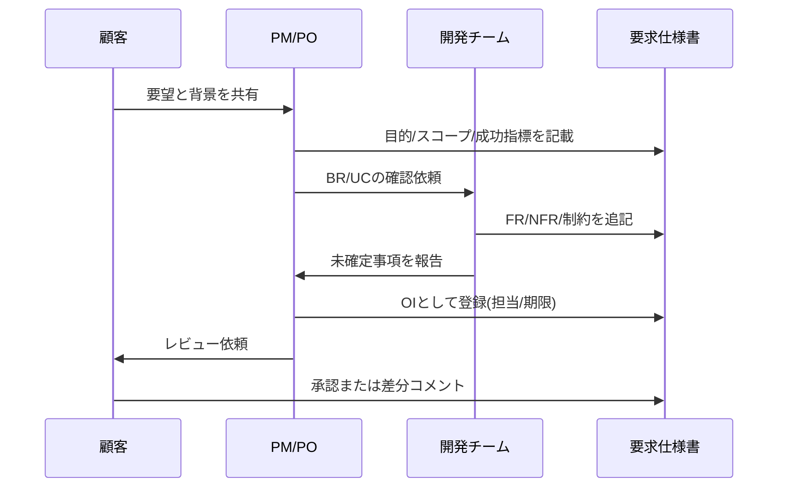

# requirements-to-spec-template

要求を仕様に落とし込むための、GitHub公開向けテンプレート集です。  
会議メモやチャットの断片を、合意可能かつテスト可能な要求仕様書に変換することを目的にしています。

本リポジトリは、以下の記事の考え方を参考に構成しています。  
[要求を仕様に落とすテンプレートを作ってみた](https://zenn.dev/channnnsm/articles/c3a6de22e71f86)

## Quick Start

1. `template.md` をコピーして、対象プロジェクト名と目的を記入する
2. `examples/order-management-sample.md` を参照しながら BR -> UC -> FR を埋める
3. `docs/writing-guide.md` のチェックリストでレビューし、未確定事項は `OI` に登録する

### 全体フロー図



### 合意形成のシーケンス図



### 5分で試す最小入力例

```text
BR-01: 受注ミスを月20件以下にする
UC-01: 業務担当者が受注CSVを登録する
FR-01: ユーザーがCSVをアップロードしたとき、システムはフォーマットを検証する
```

### FRの書き方サンプル(NG/OK)

```text
NG: ユーザーがログインできること
OK: ユーザーがIDとパスワードを入力して「ログイン」を押下したとき、
    システムは認証を実行し、成功時はダッシュボードに遷移する。
    失敗時は「ログイン情報が正しくありません」と表示する。
```

## このリポジトリでできること

- 要求(Why)と要件/仕様(What)を分離して整理する
- BR -> UC -> FR の階層で要求を構造化する
- FR を受け入れ基準付きで定義し、テスト可能にする
- NFR を数値・条件・測定方法で記述する
- 未確定事項を Open Issues として運用管理する

## 対象読者

- 要件定義を標準化したい開発チーム
- 顧客との合意形成に使える仕様書フォーマットが必要なPM/PO
- AI実装前に仕様の曖昧さを減らしたいエンジニア

## リポジトリ構成

```text
.
├── README.md
├── template.md
├── examples/
│   └── order-management-sample.md
├── docs/
│   └── writing-guide.md
├── .github/
│   ├── ISSUE_TEMPLATE/
│   │   ├── bug_report.md
│   │   └── feature_request.md
│   └── pull_request_template.md
├── CHANGELOG.md
├── CONTRIBUTING.md
└── LICENSE
```

## テンプレート構成(11セクション)

`template.md` は次のセクションで構成されています。

1. ドキュメント管理
2. プロジェクト概要
3. ステークホルダー分析
4. ビジネス要求(BR)
5. ユーザー要求/ユースケース(UC)
6. 機能要求(FR)
7. 非機能要求(NFR)
8. 制約条件(CON)
9. 外部インターフェース要求(IF)
10. 前提条件・依存関係(ASM)
11. 未解決事項(OI)・用語定義

## 使い方

1. `template.md` をコピーして新規要求仕様書を作成する
2. 「目的」「スコープIN/OUT」「成功指標」を先に確定する
3. BR -> UC -> FR の順に詳細化する
4. FR ごとに受け入れ基準をチェック可能な文で記述する
5. 未確定事項は本文に埋めず `OI` に移し、担当者と期限を設定する

## 運用ガイド

- 記述ルールとレビュー観点: `docs/writing-guide.md`
- 記入済みサンプル: `examples/order-management-sample.md`

## リリース履歴

- 変更履歴: [CHANGELOG.md](./CHANGELOG.md)

## Issue / PR 運用

- バグ報告: `.github/ISSUE_TEMPLATE/bug_report.md`
- 改善提案: `.github/ISSUE_TEMPLATE/feature_request.md`
- Pull Request: `.github/pull_request_template.md`

## ライセンス

このリポジトリは [MIT License](./LICENSE) で公開しています。

## コントリビューション

改善提案・テンプレート拡張・記入例の追加を歓迎します。  
詳細は [CONTRIBUTING.md](./CONTRIBUTING.md) を参照してください。