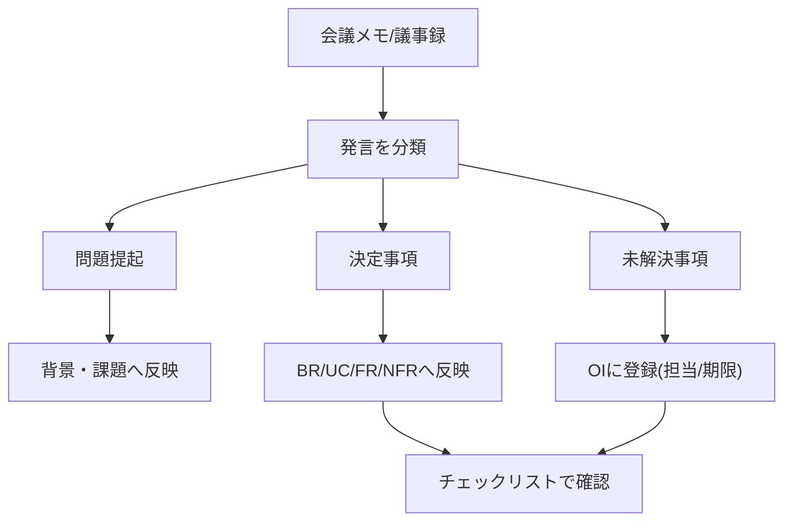

# 要求仕様書 記述ガイド

このガイドは `template.md` を使って要求仕様書を作成する際の、最小限のルールと運用手順をまとめたものです。

## 1. 基本方針

- 要求は「なぜ必要か」を書く(ビジネス視点)
- 要件/仕様は「システムが何をするか」を書く(システム視点)
- 記述は必ずテスト可能な表現にする
- 未確定事項は本文で曖昧にせず、`Open Issues` に切り出す

## 2. 記述ルール(重要)

### 2.1 BR/UC/FRの分け方

- BR: 達成したいビジネス状態
- UC: ユーザーが行いたい行動
- FR: 条件が成立したときのシステム動作

例:

- BR-01: 受注ミスを月20件以下にする
- UC-01: 業務担当者が受注CSVを登録する
- FR-01: CSVアップロード時に、システムはフォーマットを検証する

### 2.2 FRの推奨フォーマット

次の形式で統一すると、レビューやテスト設計がしやすくなります。

`[条件/トリガー] のとき、システムは [動作] する。`

避けるべき表現:

- 「適切に」「なるべく」「可能な限り」
- 主語が曖昧な文
- 実装手段に寄りすぎた文

### 2.3 受け入れ基準の書き方

FRごとに、最低でも次の5観点をチェック形式で記述します。

- 条件
- 入力
- 期待結果
- 異常系
- 境界値

Yes/No で判定できる文章にすることがポイントです。

### 2.4 NFRの書き方

非機能要求は、以下のセットで記述します。

- 目標値(例: 3秒以内、99.9%以上)
- 測定条件(例: 同時接続100ユーザー)
- 測定方法(例: APM、監視レポート)

## 3. よくある間違いと対処

### 間違い1: 「できること」だけを書いている

- 悪い例: ユーザーがログインできること
- 改善: 条件・動作・結果を明示して書く

### 間違い2: Open Issuesを放置する

- OIは「後で決める」の記録
- 担当者と期限がないOIは進まない
- 定例会議の最初にOIを確認する

### 間違い3: 承認者が空欄のまま進める

- 承認者未設定は合意責任が曖昧になる
- 草案段階から最終承認者を仮置きする

## 4. 会議メモから仕様書を作る手順

### 変換フロー図



### 会議から仕様化までのシーケンス図

```mermaid
sequenceDiagram
  participant Facilitator as 進行役
  participant Stakeholder as 参加者
  participant Note as 会議メモ
  participant Spec as 要求仕様書
  participant OI as OpenIssues

  Stakeholder->>Facilitator: 課題/要望を発言
  Facilitator->>Note: 発言を記録
  Facilitator->>Spec: 決定事項をBR/UC/FRへ反映
  Facilitator->>OI: 未解決事項を登録
  OI-->>Facilitator: 担当者/期限を付与
  Facilitator->>Spec: 制約/前提/用語を更新
  Facilitator->>Stakeholder: 更新版を共有してレビュー依頼
```

### Step A: ステークホルダーを抽出

- 誰が関わり、何を重視しているかを記録する
- そのまま「ステークホルダー分析」に反映する

### Step B: 発言を3種類に分類

- 問題提起
- 決定事項
- 未解決事項

仕様書に直接書くのは「決定事項」。未解決は `OI` に登録します。

### Step C: 制約・前提に理由を添える

制約条件は「何を守るか」だけでなく「なぜ必要か」を書くことで、後の見直し判断が容易になります。

### Step D: 用語を即時定義する

認識が割れそうな語(例: 受注/注文、旧システム)は、その場で用語定義に追加します。

## 5. レビュー観点チェックリスト

- [ ] 目的が機能説明ではなくビジネスゴールになっている
- [ ] Scope OUTが明記されている
- [ ] 成功指標が数値で記述されている
- [ ] BR -> UC -> FR のトレースが取れる
- [ ] FRごとの受け入れ基準がある
- [ ] NFRに測定条件/方法がある
- [ ] OIに担当者と期限がある
- [ ] 用語の意味が統一されている
