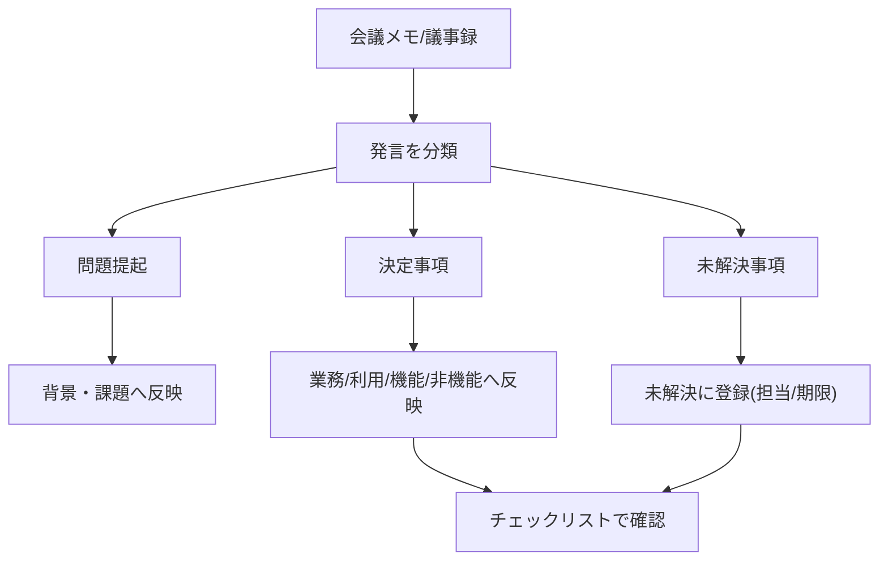
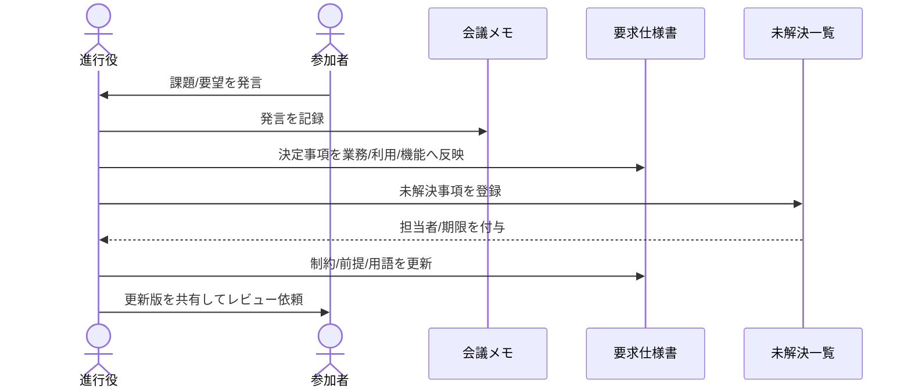

# 要求仕様書 記述ガイド

このガイドは [`template.md`](../template.md) を使って要求仕様書を作成する際の、最小限のルールと運用手順をまとめたものです。

## ID凡例(テンプレートと同一)

| プレフィックス | 日本語名 | 説明 |
| --- | --- | --- |
| `業務-XX` | 業務要求 | 達成したいビジネス状態 |
| `利用-XX` | 利用要求 | 利用者が行いたい行動 |
| `機能-XX` | 機能要求 | 条件成立時のシステム動作 |
| `非機能-XX` | 非機能要求 | 品質属性(性能・可用性など) |
| `制約-XX` | 制約条件 | 法令・技術・契約などの制限 |
| `連携-XX` | 外部連携要求 | 外部システムとの入出力 |
| `前提-XX` | 前提・依存 | 前提条件と外部依存タスク |
| `未解決-XX` | 未解決事項 | 本文に書かず切り出した未確定事項 |
| `データ-XX` | データ要求 | データ項目・整合性・保持 |
| `画面-XX` | 画面要求 | 画面イメージ・主要要素・遷移条件 |
| `リスク-XX` | リスク | 影響度・発生確率と対応方針 |

**優先度**: `必須` / `推奨` / `任意`  
**ドキュメントID**: `要件-XXXX`

---

## 1. 基本方針

- 要求は「なぜ必要か」を書く(ビジネス視点)
- 要件/仕様は「システムが何をするか」を書く(システム視点)
- 記述は必ずテスト可能な表現にする
- 未確定事項は本文で曖昧にせず、`未解決-XX` に切り出す

---

## 2. 記述ルール(重要)

### 2.1 業務・利用・機能の分け方

- **業務**: 達成したいビジネス状態
- **利用**: ユーザーが行いたい行動
- **機能**: 条件が成立したときのシステム動作

例:

- 業務-01: 受注ミスを月20件以下にする
- 利用-01: 業務担当者が受注CSVを登録する
- 機能-01: CSVアップロード時に、システムはフォーマットを検証する

### 2.2 機能要求の推奨フォーマット

次の形式で統一すると、レビューやテスト設計がしやすくなります。

`[条件/トリガー] のとき、システムは [動作] する。`

避けるべき表現:

- 「適切に」「なるべく」「可能な限り」
- 主語が曖昧な文
- 実装手段に寄りすぎた文

### 2.3 受け入れ基準の書き方

機能ごとに、最低でも次の5観点をチェック形式で記述します。

- 条件
- 入力
- 期待結果
- 異常系
- 境界値

Yes/No で判定できる文章にすることがポイントです。

**Given-When-Then(任意だが推奨)**

シナリオが複雑な場合は、次の形式で補足すると認識のズレが減ります。

```text
Given  [前提状態]
When   [操作またはトリガー]
Then   [期待する結果]
```

例:

```text
Given  有効なユーザーアカウントが存在する
When   ユーザーが正しいIDとパスワードでログインを試みる
Then   システムはダッシュボードへ遷移し、最終ログイン日時を更新する
```

### 2.4 非機能要求の書き方

非機能要求は、以下のセットで記述します。

- 目標値(例: 3秒以内、99.9%以上)
- 測定条件(例: 同時接続100ユーザー)
- 測定方法(例: APM(アプリ性能監視)、監視レポート)

分類は [ISO/IEC 25010](https://www.iso.org/standard/35733.html) の品質モデルを参考にすると抜け漏れが減ります。

### 2.5 画面要求(UIイメージ)の書き方

機能要求と利用要求を裏付ける UI を、画面ID(`画面-XX`)単位で整理します。

- **格納場所**: 画像は `assets/screens/<プロジェクト識別子>/` に配置する(複数プロジェクトでIDが衝突しないよう、サブディレクトリで名前空間を分ける)
- **ファイル名**: `画面-ID_画面名_状態.<拡張子>` で統一(推奨: `.png` / `.svg`)
- **サブディレクトリ命名例**: `assets/screens/saas-feature/`、`assets/screens/order-management/`、テンプレートで参照する汎用例は `assets/screens/_template/` を使用
- **代替テキスト必須**: `` 形式で、スクリーンリーダー対応にする
- **1画像 = 1画面 × 1状態**: 「初期」「入力済」「エラー」など状態を分けて掲載する
- **解像度・容量**: 横幅 1200px 以下・1ファイル 300KB 以下を目安に圧縮する(差分レビューの負荷軽減)
- **個人情報マスク**: 実データのキャプチャは氏名・メール・金額などをマスクする
- **未確定は未解決へ**: 仮モックでも構わないが、「正式版未確定」を `未解決-XX` に登録し、担当者と期限を明記する
- **トレーサビリティ列**: トレーサビリティ表の `画面` 列に対応するIDを記載する

画面詳細では、以下を併記すると認識のズレが減ります。

- 状態(初期表示/入力済/エラー など)
- 主要要素(入力欄・ボタン・メッセージ)
- 遷移(正常時・異常時)
- 関連受け入れ基準(`機能-XX` を参照)

### 2.6 トレーサビリティ

`template.md` の「トレーサビリティ」表に、業務→利用→機能→画面→非機能→データ→テストの対応を記載します。行が埋まらない場合は、上流の要求が不足しているサインです。

---

## 3. よくある間違いと対処

### 間違い1: 「できること」だけを書いている

- 悪い例: ユーザーがログインできること
- 改善: 条件・動作・結果を明示して書く

### 間違い2: 未解決事項を放置する

- `未解決-XX` は「後で決める」の記録
- 担当者と期限がない未解決事項は進まない
- 定例会議の最初に未解決一覧を確認する

### 間違い3: 承認者が空欄のまま進める

- 承認者未設定は合意責任が曖昧になる
- 草案段階から最終承認者を仮置きする

---

## 4. 会議メモから仕様書を作る手順

### 4.1 変換フロー図



### 4.2 会議から仕様化までのシーケンス図



### 4.3 Mermaid（予約語・識別子の注意）

シーケンス図では、**`participant` の識別子**が構文キーワードと衝突すると描画エラーになります。特に次は避けてください（大文字・小文字の扱いはレンダラ依存のため、似た名前も避けるのが安全です）。

- **`Note` / `note`**: 注記構文 `Note left of` 等と衝突しやすい（本リポジトリの例では `memo` を使用）
- **`end` / `loop` / `opt` / `alt` / `par` / `and` / `else` / `rect` / `critical` / `break` / `option` / `box`**: ブロック構文と衝突しうる
- **`activate` / `deactivate` / `autonumber` / `link` / `links` / `create` / `destroy`**: ディレクティブと衝突しうる

フローチャートでは、**ノードIDに単独の `end`** を使うと図が壊れやすいです（[Mermaid 公式](https://mermaid.js.org/syntax/sequenceDiagram.html)の注意）。必要ならラベル側に括弧や引用符を使って表現してください。

### ステップ1: ステークホルダーを抽出

- 誰が関わり、何を重視しているかを記録する
- そのまま「ステークホルダー分析」に反映する

### ステップ2: 発言を3種類に分類

- 問題提起
- 決定事項
- 未解決事項

仕様書に直接書くのは「決定事項」。未解決は `未解決-XX` に登録します。

### ステップ3: 制約・前提に理由を添える

制約条件は「何を守るか」だけでなく「なぜ必要か」を書くことで、後の見直し判断が容易になります。

### ステップ4: 用語を即時定義する

認識が割れそうな語(例: 受注/注文、旧システム)は、その場で用語定義に追加します。

---

## 5. レビュー観点チェックリスト

- [ ] 目的が機能説明ではなくビジネスゴールになっている
- [ ] スコープ外が明記されている
- [ ] 成功指標が数値で記述されている
- [ ] 業務 → 利用 → 機能 のトレースが取れる
- [ ] トレーサビリティ表が最新になっている
- [ ] 機能ごとの受け入れ基準がある
- [ ] 画面要求に代替テキスト・状態・遷移が記載されている
- [ ] 非機能に測定条件/方法がある
- [ ] データ要求に整合性・保持が書かれている
- [ ] 未解決事項に担当者と期限がある
- [ ] 用語の意味が統一されている
