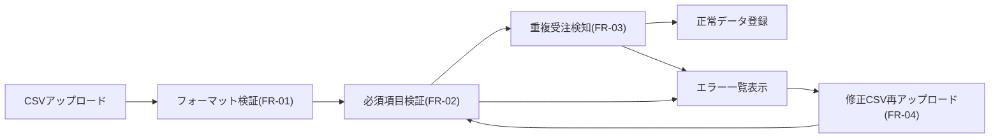
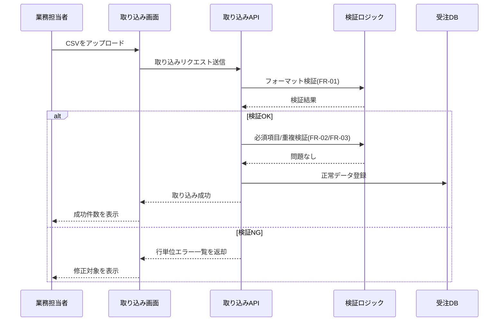

# 要求仕様書サンプル: 受注データ取り込み

## 処理イメージ図

## 取り込み処理シーケンス

## ドキュメント管理

| 項目 | 値 |
| --- | --- |
| ドキュメントID | REQ-ORDER-001 |
| バージョン | 0.2.0 |
| ステータス | レビュー中 |
| 作成日 | 2026-05-12 |
| 最終更新日 | 2026-05-12 |
| 作成者 | プロダクト企画チーム |
| 承認者(顧客側) | A社 業務部長 |

## 1. プロジェクト概要

### 1.1 目的

受注入力時の転記ミスを削減し、月次の受注処理リードタイムを短縮する。

### 1.2 背景・課題

- 複数フォーマットのCSVを手作業で転記している
- 必須項目漏れや重複登録の発生率が高い
- 入力ミスの検知が月末まで遅延する

### 1.3 スコープ

**Scope IN**

- A社・B社フォーマットのCSVを取り込む
- 取り込み結果を一覧で確認できる
- エラー詳細を行単位で表示する

**Scope OUT**

- C社フォーマットの取り込み
- 過去5年分データの一括移行

### 1.4 成功指標

| 指標カテゴリ | 指標 | 目標値 | 測定条件 | 測定方法 |
| --- | --- | --- | --- | --- |
| 品質 | 取り込み後のデータ不整合率 | 0.1%以下 | 本番1か月運用 | サンプリング監査 |
| 速度 | 1,000件取り込み時間 | 3分以内 | 平日昼間、同時接続50 | 処理ログ計測 |
| 期限 | 顧客受け入れ完了日 | 2026-07-31まで | UAT実施 | 承認記録 |

## 2. ステークホルダー分析

| 役割 | 担当者/組織 | 関心事 | 意思決定権 | 備考 |
| --- | --- | --- | --- | --- |
| 顧客責任者 | A社 業務部長 | 運用負荷削減 | 高 | 最終承認者 |
| PM/PO | 自社PM | スケジュール、品質 | 高 | 予算管理含む |
| 開発チーム | 開発1課 | 実装工数、保守性 | 中 |  |
| 運用担当 | サポートチーム | 障害検知、問い合わせ対応 | 中 |  |

## 3. ビジネス要求(BR)

| ID | ビジネス要求 | 根拠/背景 | 優先度 | 成功判定 |
| --- | --- | --- | --- | --- |
| BR-01 | 受注ミスを月20件以下にする | 手戻り工数が大きい | Must | 月次監査で確認 |
| BR-02 | 入力作業時間を30%短縮する | 担当者の残業増加 | Should | 工数実績で確認 |

## 4. ユーザー要求・ユースケース(UC)

| ID | 対象ユーザー | 目的 | トリガー | 期待結果 |
| --- | --- | --- | --- | --- |
| UC-01 | 業務担当者 | 受注CSVを登録する | 朝の受注取り込み作業 | 正常データが登録される |
| UC-02 | 業務担当者 | エラー行を再修正する | 取り込み失敗通知 | 修正後に再登録できる |

## 5. 機能要求(FR)

| ID | 関連UC | 機能要求 | 優先度 | 備考 |
| --- | --- | --- | --- | --- |
| FR-01 | UC-01 | ユーザーがCSVをアップロードしたとき、システムはフォーマットを検証する | Must | A社/B社のみ |
| FR-02 | UC-01 | 必須項目が欠落しているとき、システムは対象行とエラー理由を表示する | Must | 行番号表示 |
| FR-03 | UC-01 | 同一受注番号が既存データに存在するとき、システムは重複として登録を拒否する | Must |  |
| FR-04 | UC-02 | ユーザーが修正済CSVを再アップロードしたとき、システムは差分のみ再検証する | Should | 処理時間短縮 |

### FR-01 受け入れ基準

- [x] 条件: A社またはB社フォーマットのCSV
- [x] 入力: UTF-8、ヘッダー付きCSV
- [x] 期待結果: フォーマットが正しければ検証処理へ進む
- [x] 異常系: 未対応フォーマットはエラーメッセージを表示
- [x] 境界値: 空ファイルはアップロード不可

### FR-02 受け入れ基準

- [x] 条件: 必須項目が空欄
- [x] 入力: 必須項目欠落データを含むCSV
- [x] 期待結果: 行番号、項目名、理由を一覧表示
- [x] 異常系: エラー行が100件超の場合は先頭100件を表示しCSVで全件DL可能
- [x] 境界値: 10MBちょうどのファイルは受け付ける

## 6. 非機能要求(NFR)

| ID | 分類 | 要求 | 目標値 | 測定条件 | 測定方法 |
| --- | --- | --- | --- | --- | --- |
| NFR-01 | 性能 | CSV取り込み処理時間 | 3分以内/1,000件 | 同時接続50 | APM計測 |
| NFR-02 | 可用性 | 稼働率 | 99.9%以上/月 | 計画停止除外 | 監視レポート |
| NFR-03 | セキュリティ | 通信暗号化 | TLS1.2以上 | 全通信 | 設定監査 |

## 7. 制約条件(CON)

| ID | 制約内容 | 理由 | 影響範囲 |
| --- | --- | --- | --- |
| CON-01 | 既存認証基盤を流用する | 新規構築はスコープ外 | ログイン周り |
| CON-02 | 対応ブラウザは最新2世代 | 既存運用端末に準拠 | フロント実装 |

## 8. 外部インターフェース要求(IF)

| ID | 連携先 | インターフェース | データ形式 | I/O | 備考 |
| --- | --- | --- | --- | --- | --- |
| IF-01 | 顧客SFTP | File | CSV | 入力 | 日次バッチ |
| IF-02 | 通知サービス | API | JSON | 出力 | エラー通知 |

## 9. 前提条件・依存関係(ASM)

| ID | 前提/依存 | 内容 | 担当 | 期限 | 状態 |
| --- | --- | --- | --- | --- | --- |
| ASM-01 | 依存関係 | 通知サービスAPIキー発行 | 顧客IT | 2026-06-10 | 進行中 |
| ASM-02 | 前提条件 | B社CSV仕様の最終版受領 | 顧客業務チーム | 2026-06-05 | 未着手 |

## 10. 未解決事項(Open Issues: OI)

| ID | 未解決事項 | 担当者 | 期限 | 状態 | 関連ID |
| --- | --- | --- | --- | --- | --- |
| OI-01 | B社CSVの日付フォーマットが未確定 | 顧客業務チーム | 2026-05-30 | 未解決 | FR-01 |
| OI-02 | エラー通知の送信先グループ定義 | 顧客IT | 2026-06-03 | 未解決 | IF-02 |

## 11. 用語定義

| 用語 | 定義 | 備考 |
| --- | --- | --- |
| 受注番号 | 受注を一意に識別するキー | 顧客既存システムと同一 |
| 取り込みエラー | 仕様に合わない入力で登録不能な状態 | 検証ログに記録 |
