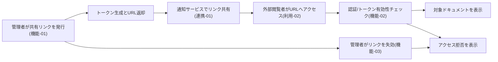
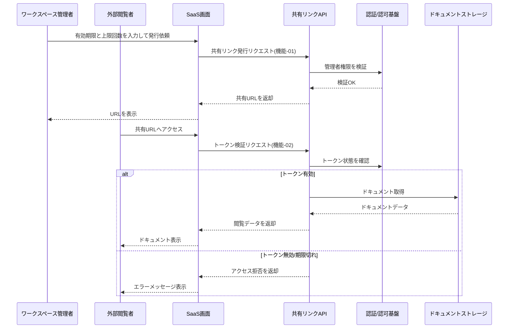
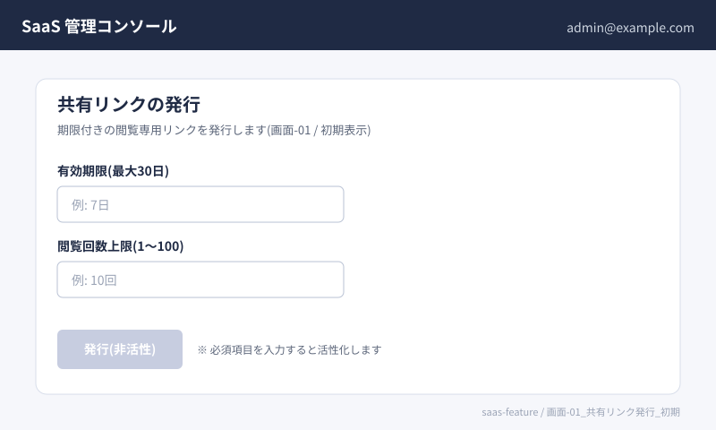
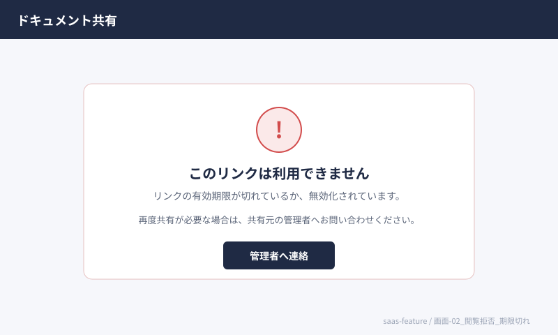

# 要求仕様書サンプル: SaaS の「チーム共有リンク」機能追加

## 処理イメージ図



## 共有リンク利用シーケンス



## ドキュメント管理

| 項目 | 値 |
| --- | --- |
| ドキュメントID | 要件-SAAS-SHARE-001 |
| バージョン | 0.1.0 |
| ステータス | 草案 |
| 作成日 | 2026-05-13 |
| 最終更新日 | 2026-05-13 |
| 作成者 | プロダクトチーム |
| 承認者(顧客側) |  |

## 1. プロジェクト概要

### 1.1 目的

ワークスペース外の関係者と、期限付きの閲覧専用リンクで安全に資料を共有し、問い合わせ対応の往復を減らす。

### 1.2 背景・課題

- 外部へPDFをメール添付しており、版管理とアクセス制御が困難
- 共有解除の手作業が漏れやすい

### 1.3 スコープ

**スコープ内**

- 閲覧専用リンクの発行・失効
- リンク経由の単一ドキュメント閲覧
- 監査ログへの記録

**スコープ外**

- 編集権限の付与
- オンプレミス環境向け機能

### 1.4 成功指標(KPI)

| 指標カテゴリ | 指標 | 目標値 | 測定条件 | 測定方法 |
| --- | --- | --- | --- | --- |
| 品質 | 誤共有インシデント件数 | 0件/四半期 | 本番運用 | インシデント管理 |
| 速度 | リンク発行完了時間 | 5秒以内(P95) | API(Application Programming Interface)計測 | APM(アプリ性能監視) |
| 期限 | ユーザー受け入れテスト(UAT)完了 | 2026-06-30まで | ステージング | 承認記録 |

## 2. ステークホルダー分析

| 役割 | 担当者/組織 | 関心事 | 意思決定権 | 備考 |
| --- | --- | --- | --- | --- |
| 顧客責任者 | CS責任者 | セキュリティと使いやすさ | 高 |  |
| プロダクトマネージャー(PM)/プロダクトオーナー(PO) | 自社PM | 工数・リリース計画 | 高 |  |
| 開発チーム | Webアプリチーム | 実装・保守 | 中 |  |
| 運用担当 | SRE | 監査・障害対応 | 中 |  |

## 3. 業務要求

| ID | 業務要求 | 根拠/背景 | 優先度 | 成功判定 |
| --- | --- | --- | --- | --- |
| 業務-01 | 外部共有に関する問い合わせ工数を20%削減する | CS負荷 | 必須 | チケット件数比較 |
| 業務-02 | 共有リンクの失効漏れをゼロに近づける | 情報漏えいリスク | 推奨 | 失効ジョブ成功率 |

## 4. 利用要求・ユースケース

| ID | 対象ユーザー | 目的 | トリガー | 期待結果 |
| --- | --- | --- | --- | --- |
| 利用-01 | ワークスペース管理者 | 閲覧専用リンクを発行する | 顧客レビュー依頼 | 期限付きURLが発行される |
| 利用-02 | 外部閲覧者 | リンクから資料を閲覧する | URLを開く | 認証後に閲覧できる |

## 5. 機能要求

| ID | 関連利用 | 機能要求 | 優先度 | 備考 |
| --- | --- | --- | --- | --- |
| 機能-01 | 利用-01 | 管理者が有効期限と閲覧回数上限を指定して共有リンクを発行したとき、システムはトークンを生成しURLを返す | 必須 |  |
| 機能-02 | 利用-02 | 閲覧者が有効なトークンでアクセスしたとき、システムは対象ドキュメントを表示する | 必須 |  |
| 機能-03 | 利用-01 | 管理者がリンクを失効させたとき、システムは以降のアクセスを拒否する | 必須 |  |

### 機能-01 受け入れ基準

- [ ] 条件: 管理者ロールでログイン済み
- [ ] 入力: 有効期限(最大30日)、閲覧回数上限(1〜100)
- [ ] 期待結果: HTTPSの共有URLが発行される
- [ ] 異常系: 期限が30日超の場合はバリデーションエラー
- [ ] 境界値: 閲覧回数上限=1で1回閲覧後は拒否

**Given-When-Then(例)**

```text
Given  管理者が対象ドキュメントの共有権限を持つ
When   有効期限を7日、閲覧上限を10回でリンク発行APIを呼ぶ
Then   システムは一意なトークンとHTTPSの共有URLを返す
```

## 6. 画面要求(UIイメージ)

### 6.1 画面要求一覧

| ID | 画面名 | 関連利用 | 関連機能 | 主目的 | 備考 |
| --- | --- | --- | --- | --- | --- |
| 画面-01 | 共有リンク発行 | 利用-01 | 機能-01 | 期限付きURLを発行する |  |
| 画面-02 | 閲覧結果(拒否) | 利用-02 | 機能-02 | アクセス拒否を伝える | トークン無効/期限切れ時 |

### 6.2 画面詳細

#### 画面-01 共有リンク発行



- 状態: 初期表示
- 主要要素:
  - 有効期限入力(最大30日)
  - 閲覧回数上限入力(1〜100)
  - 「発行」ボタン(必須項目未入力時は非活性)
- 遷移:
  - 発行成功 → 共有URLを表示するダイアログ
  - バリデーションエラー → 同画面でエラーメッセージを表示
- 関連受け入れ基準: 機能-01

#### 画面-02 閲覧結果(拒否)



- 状態: トークン無効/期限切れ
- 主要要素:
  - 拒否理由メッセージ(「リンクの有効期限が切れています」など)
  - 管理者への問い合わせ導線
- 遷移:
  - リトライ不可(再発行は管理者経由)
- 関連受け入れ基準: 機能-02、機能-03

## 7. 非機能要求

| ID | 分類 | 要求 | 目標値 | 測定条件 | 測定方法 |
| --- | --- | --- | --- | --- | --- |
| 非機能-01 | セキュリティ | 共有URLは推測困難なトークンとする | エントロピー128bit相当 | 設計レビュー | 脅威モデリング |
| 非機能-02 | 性能効率性 | リンク発行APIの応答 | P95で500ms以内 | 同時100 | APM(アプリ性能監視) |

## 8. 制約条件

| ID | 制約内容 | 理由 | 影響範囲 |
| --- | --- | --- | --- |
| 制約-01 | 既存の認可モデルに準拠する | セキュリティ一貫性 | バックエンド |

## 9. 外部連携要求

| ID | 連携先 | インターフェース | データ形式 | 入出力 | 備考 |
| --- | --- | --- | --- | --- | --- |
| 連携-01 | メール配信サービス | API | JSON | 出力 | リンク通知(任意) |

## 10. 前提条件・依存関係

| ID | 前提/依存 | 内容 | 担当 | 期限 | 状態 |
| --- | --- | --- | --- | --- | --- |
| 前提-01 | 前提条件 | オブジェクトストレージ上のドキュメント参照方式が確定している | 基盤 | YYYY-MM-DD | 未着手 |

## 11. 未解決事項

| ID | 未解決事項 | 担当者 | 期限 | 状態 | 関連ID |
| --- | --- | --- | --- | --- | --- |
| 未解決-01 | 外部閲覧者の認証方式(メールOTPか匿名か) | PM | YYYY-MM-DD | 未解決 | 機能-02 |

## 12. トレーサビリティ

| 業務 | 利用 | 機能 | 画面 | 非機能 | データ | テスト観点/ケースID |
| --- | --- | --- | --- | --- | --- | --- |
| 業務-01 | 利用-01 | 機能-01 | 画面-01 | 非機能-02 | データ-01 | TC-SHARE-001 |
| 業務-02 | 利用-02 | 機能-02 | 画面-02 | 非機能-01 | データ-01 | TC-SHARE-002 |

## 13. データ要求

| ID | データ/エンティティ | 項目・制約 | 整合性 | 保持期間 | 備考 |
| --- | --- | --- | --- | --- | --- |
| データ-01 | 共有トークン | ハッシュ保存、平文は返却時のみ | 失効フラグと整合 | 失効後90日で削除 | 監査用にメタデータ保持 |

## 14. リスク

| ID | リスク内容 | 発生確率 | 影響度 | 対応方針 | 関連ID |
| --- | --- | --- | --- | --- | --- |
| リスク-01 | トークン漏えいによる不正閲覧 | 低 | 高 | 軽減(短期TTL・失効UI) | 非機能-01 |

## 15. 用語定義

| 用語 | 定義 | 備考 |
| --- | --- | --- |
| 共有トークン | 外部閲覧を許可する一時鍵 | URLに埋め込まない設計も可 |
