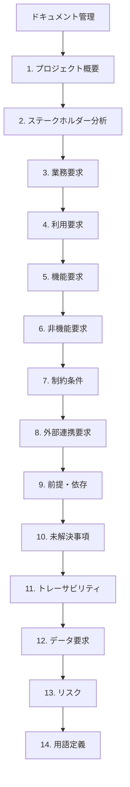
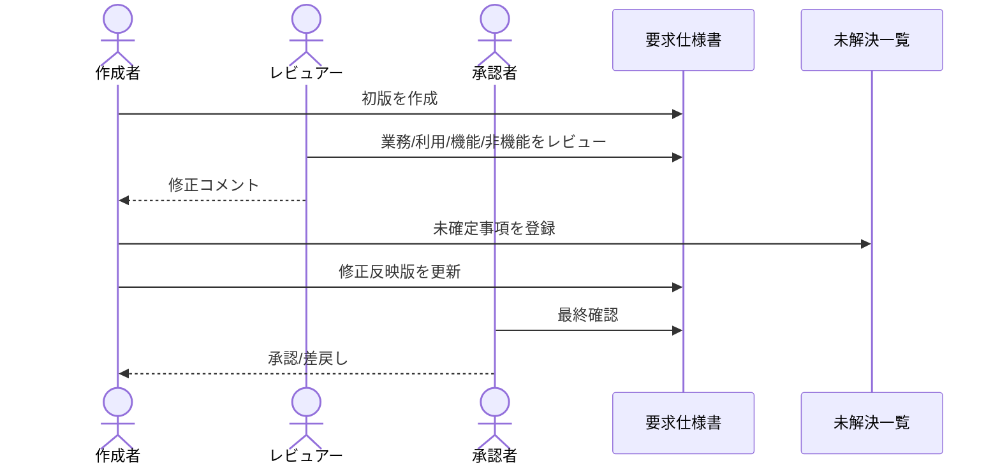

# 要求仕様書テンプレート

## ID凡例とプレフィックス

| プレフィックス | 日本語名 | 説明 |
| --- | --- | --- |
| `業務-XX` | 業務要求 | 達成したいビジネス状態・目的 |
| `利用-XX` | 利用要求(ユースケース) | 利用者が行いたい行動・シナリオ |
| `機能-XX` | 機能要求 | 条件成立時のシステム動作 |
| `非機能-XX` | 非機能要求 | 性能・可用性・セキュリティ等の品質属性 |
| `制約-XX` | 制約条件 | 守るべき制限(法令・技術・契約など) |
| `連携-XX` | 外部連携要求 | 外部システム・API・ファイル連携 |
| `前提-XX` | 前提・依存 | 前提条件と外部依存タスク |
| `未解決-XX` | 未解決事項 | 本文に書かず切り出した未確定事項 |
| `データ-XX` | データ要求 | データ項目・整合性・保持・マスタ参照 |
| `リスク-XX` | リスク | 影響度・発生確率と対応方針 |

**優先度**: `必須` / `推奨` / `任意`  
**ドキュメントID**: `要件-XXXX` 形式で付番する。

---

## 記入の流れ(参照図)



## レビュー運用シーケンス(参照図)



## ドキュメント管理

| 項目 | 値 |
| --- | --- |
| ドキュメントID | 要件-XXXX |
| バージョン | 0.1.0 |
| ステータス | 草案 / レビュー中 / 承認済 |
| 作成日 | YYYY-MM-DD |
| 最終更新日 | YYYY-MM-DD |
| 作成者 |  |
| 承認者(顧客側) |  |
| 関連資料 |  |

---

## 1. プロジェクト概要

### 1.1 目的(Why)

- 例: 受注入力の手作業ミスを削減し、業務担当者が本来業務に集中できる状態を実現する

### 1.2 背景・課題

- 現状の業務フロー:
- 課題:
- 課題によるビジネス影響:

### 1.3 スコープ

**スコープ内**

- [ ]
- [ ]

**スコープ外**

- [ ]
- [ ]

### 1.4 成功指標(KPI)

| 指標カテゴリ | 指標 | 目標値 | 測定条件 | 測定方法 |
| --- | --- | --- | --- | --- |
| 品質 |  |  |  |  |
| 速度 |  |  |  |  |
| 期限 |  |  |  |  |

---

## 2. ステークホルダー分析

| 役割 | 担当者/組織 | 関心事 | 意思決定権 | 備考 |
| --- | --- | --- | --- | --- |
| 顧客責任者 |  |  | 高 / 中 / 低 |  |
| プロダクトマネージャー(PM)/プロダクトオーナー(PO) |  |  | 高 / 中 / 低 |  |
| 開発チーム |  |  | 高 / 中 / 低 |  |
| 運用担当 |  |  | 高 / 中 / 低 |  |

---

## 3. 業務要求

| ID | 業務要求 | 根拠/背景 | 優先度 | 成功判定 |
| --- | --- | --- | --- | --- |
| 業務-01 |  |  | 必須 / 推奨 / 任意 |  |
| 業務-02 |  |  | 必須 / 推奨 / 任意 |  |

---

## 4. 利用要求・ユースケース

| ID | 対象ユーザー | 目的 | トリガー | 期待結果 |
| --- | --- | --- | --- | --- |
| 利用-01 |  |  |  |  |
| 利用-02 |  |  |  |  |

---

## 5. 機能要求

### 記述ルール

- 推奨形式: 「[条件/トリガー] のとき、システムは [動作] する」
- あいまい語(なるべく、適切に、可能な限り)を避ける
- 実装手段ではなく期待するシステム動作を書く

### 機能要求一覧

| ID | 関連利用 | 機能要求 | 優先度 | 備考 |
| --- | --- | --- | --- | --- |
| 機能-01 | 利用-01 |  | 必須 / 推奨 / 任意 |  |
| 機能-02 | 利用-01 |  | 必須 / 推奨 / 任意 |  |

### 5.x 受け入れ基準(各機能に対して記入)

チェックリスト(条件・入力・期待結果・異常系・境界値)に加え、必要に応じて **Given-When-Then** で補足する。

**Given-When-Then の例**

```text
Given  有効なユーザーアカウントが存在する
When   ユーザーが正しいIDとパスワードでログインを試みる
Then   システムはダッシュボードへ遷移し、最終ログイン日時を更新する
```

#### 機能-01 受け入れ基準

- [ ] 条件:
- [ ] 入力:
- [ ] 期待結果:
- [ ] 異常系:
- [ ] 境界値:
- [ ] Given-When-Then(任意):

#### 機能-02 受け入れ基準

- [ ] 条件:
- [ ] 入力:
- [ ] 期待結果:
- [ ] 異常系:
- [ ] 境界値:
- [ ] Given-When-Then(任意):

---

## 6. 非機能要求

分類は [ISO/IEC 25010](https://www.iso.org/standard/35733.html) の品質モデルを参考にし、必要に応じて行を追加する。

| ID | 分類 | 要求 | 目標値 | 測定条件 | 測定方法 |
| --- | --- | --- | --- | --- | --- |
| 非機能-01 | 性能効率性 |  |  |  |  |
| 非機能-02 | 信頼性/可用性 |  |  |  |  |
| 非機能-03 | セキュリティ |  |  |  |  |
| 非機能-04 | 保守性/運用性 |  |  |  |  |

---

## 7. 制約条件

| ID | 制約内容 | 理由 | 影響範囲 |
| --- | --- | --- | --- |
| 制約-01 |  |  |  |
| 制約-02 |  |  |  |

---

## 8. 外部連携要求

| ID | 連携先 | インターフェース | データ形式 | 入出力 | 備考 |
| --- | --- | --- | --- | --- | --- |
| 連携-01 |  | API / ファイル / DB / メッセージ | JSON / CSV / XML | 入力 / 出力 |  |
| 連携-02 |  | API / ファイル / DB / メッセージ | JSON / CSV / XML | 入力 / 出力 |  |

---

## 9. 前提条件・依存関係

| ID | 前提/依存 | 内容 | 担当 | 期限 | 状態 |
| --- | --- | --- | --- | --- | --- |
| 前提-01 | 前提条件 |  |  | YYYY-MM-DD | 未着手 / 進行中 / 完了 |
| 前提-02 | 依存関係 |  |  | YYYY-MM-DD | 未着手 / 進行中 / 完了 |

---

## 10. 未解決事項

| ID | 未解決事項 | 担当者 | 期限 | 状態 | 関連ID |
| --- | --- | --- | --- | --- | --- |
| 未解決-01 |  |  | YYYY-MM-DD | 未解決 / 解決済 | 機能-XX |
| 未解決-02 |  |  | YYYY-MM-DD | 未解決 / 解決済 | 非機能-XX |

---

## 11. トレーサビリティ

業務からテストケースまでの対応を一覧化する(行は必要数だけ追加)。

| 業務 | 利用 | 機能 | 非機能 | データ | テスト観点/ケースID |
| --- | --- | --- | --- | --- | --- |
| 業務-01 | 利用-01 | 機能-01 | 非機能-01 | データ-01 | TC-001 |
|  |  |  |  |  |  |

---

## 12. データ要求

| ID | データ/エンティティ | 項目・制約 | 整合性 | 保持期間 | 備考 |
| --- | --- | --- | --- | --- | --- |
| データ-01 |  |  |  |  |  |
| データ-02 |  |  |  |  |  |

---

## 13. リスク

| ID | リスク内容 | 発生確率 | 影響度 | 対応方針 | 関連ID |
| --- | --- | --- | --- | --- | --- |
| リスク-01 |  | 低/中/高 | 低/中/高 | 回避/軽減/受容/転嫁 |  |
| リスク-02 |  | 低/中/高 | 低/中/高 | 回避/軽減/受容/転嫁 |  |

---

## 14. 用語定義

| 用語 | 定義 | 備考 |
| --- | --- | --- |
|  |  |  |
|  |  |  |

---

## 変更履歴

| バージョン | 日付 | 変更内容 | 変更者 |
| --- | --- | --- | --- |
| 0.1.0 | YYYY-MM-DD | 初版作成 |  |
