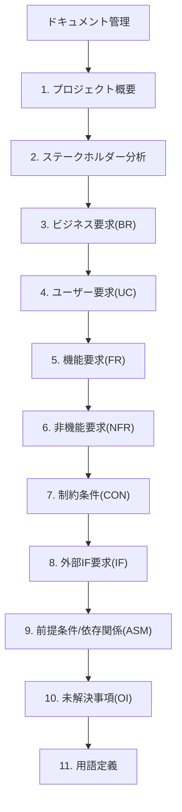
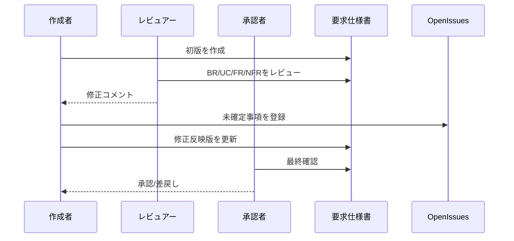

# 要求仕様書テンプレート

## 記入の流れ(参照図)

## レビュー運用シーケンス(参照図)

## ドキュメント管理

| 項目 | 値 |
| --- | --- |
| ドキュメントID | REQ-XXXX |
| バージョン | 0.1.0 |
| ステータス | 草案 / レビュー中 / 承認済 |
| 作成日 | YYYY-MM-DD |
| 最終更新日 | YYYY-MM-DD |
| 作成者 |  |
| 承認者(顧客側) |  |
| 関連資料 |  |

---

## 1. プロジェクト概要

### 1.1 目的(Why)

- 例: 受注入力の手作業ミスを削減し、業務担当者が本来業務に集中できる状態を実現する

### 1.2 背景・課題

- 現状の業務フロー:
- 課題:
- 課題によるビジネス影響:

### 1.3 スコープ

**Scope IN**

- [ ] 
- [ ] 

**Scope OUT**

- [ ] 
- [ ] 

### 1.4 成功指標(KPI)

| 指標カテゴリ | 指標 | 目標値 | 測定条件 | 測定方法 |
| --- | --- | --- | --- | --- |
| 品質 |  |  |  |  |
| 速度 |  |  |  |  |
| 期限 |  |  |  |  |

---

## 2. ステークホルダー分析

| 役割 | 担当者/組織 | 関心事 | 意思決定権 | 備考 |
| --- | --- | --- | --- | --- |
| 顧客責任者 |  |  | 高 / 中 / 低 |  |
| PM/PO |  |  | 高 / 中 / 低 |  |
| 開発チーム |  |  | 高 / 中 / 低 |  |
| 運用担当 |  |  | 高 / 中 / 低 |  |

---

## 3. ビジネス要求(BR)

| ID | ビジネス要求 | 根拠/背景 | 優先度 | 成功判定 |
| --- | --- | --- | --- | --- |
| BR-01 |  |  | Must / Should / Could |  |
| BR-02 |  |  | Must / Should / Could |  |

---

## 4. ユーザー要求・ユースケース(UC)

| ID | 対象ユーザー | 目的 | トリガー | 期待結果 |
| --- | --- | --- | --- | --- |
| UC-01 |  |  |  |  |
| UC-02 |  |  |  |  |

---

## 5. 機能要求(FR)

### 記述ルール

- 推奨形式: 「[条件/トリガー] のとき、システムは [動作] する」
- あいまい語(なるべく、適切に、可能な限り)を避ける
- 実装手段ではなく期待するシステム動作を書く

### 機能要求一覧

| ID | 関連UC | 機能要求 | 優先度 | 備考 |
| --- | --- | --- | --- | --- |
| FR-01 | UC-01 |  | Must / Should / Could |  |
| FR-02 | UC-01 |  | Must / Should / Could |  |

### 5.x 受け入れ基準(各FRに対して記入)

#### FR-01 受け入れ基準

- [ ] 条件:
- [ ] 入力:
- [ ] 期待結果:
- [ ] 異常系:
- [ ] 境界値:

#### FR-02 受け入れ基準

- [ ] 条件:
- [ ] 入力:
- [ ] 期待結果:
- [ ] 異常系:
- [ ] 境界値:

---

## 6. 非機能要求(NFR)

| ID | 分類 | 要求 | 目標値 | 測定条件 | 測定方法 |
| --- | --- | --- | --- | --- | --- |
| NFR-01 | 性能 |  |  |  |  |
| NFR-02 | 可用性 |  |  |  |  |
| NFR-03 | セキュリティ |  |  |  |  |
| NFR-04 | 運用/監視 |  |  |  |  |

---

## 7. 制約条件(CON)

| ID | 制約内容 | 理由 | 影響範囲 |
| --- | --- | --- | --- |
| CON-01 |  |  |  |
| CON-02 |  |  |  |

---

## 8. 外部インターフェース要求(IF)

| ID | 連携先 | インターフェース | データ形式 | I/O | 備考 |
| --- | --- | --- | --- | --- | --- |
| IF-01 |  | API / File / DB / Message | JSON / CSV / XML | 入力 / 出力 |  |
| IF-02 |  | API / File / DB / Message | JSON / CSV / XML | 入力 / 出力 |  |

---

## 9. 前提条件・依存関係(ASM)

| ID | 前提/依存 | 内容 | 担当 | 期限 | 状態 |
| --- | --- | --- | --- | --- | --- |
| ASM-01 | 前提条件 |  |  | YYYY-MM-DD | 未着手 / 進行中 / 完了 |
| ASM-02 | 依存関係 |  |  | YYYY-MM-DD | 未着手 / 進行中 / 完了 |

---

## 10. 未解決事項(Open Issues: OI)

| ID | 未解決事項 | 担当者 | 期限 | 状態 | 関連ID |
| --- | --- | --- | --- | --- | --- |
| OI-01 |  |  | YYYY-MM-DD | 未解決 / 解決済 | FR-XX |
| OI-02 |  |  | YYYY-MM-DD | 未解決 / 解決済 | NFR-XX |

---

## 11. 用語定義

| 用語 | 定義 | 備考 |
| --- | --- | --- |
|  |  |  |
|  |  |  |

---

## 変更履歴

| バージョン | 日付 | 変更内容 | 変更者 |
| --- | --- | --- | --- |
| 0.1.0 | YYYY-MM-DD | 初版作成 |  |

