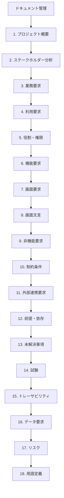
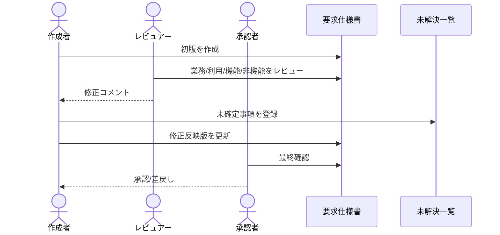
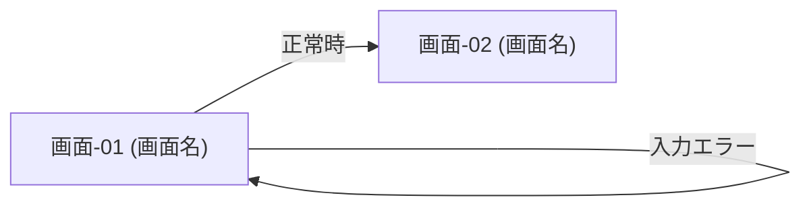
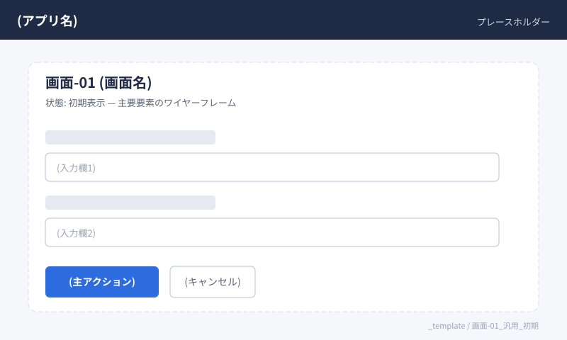
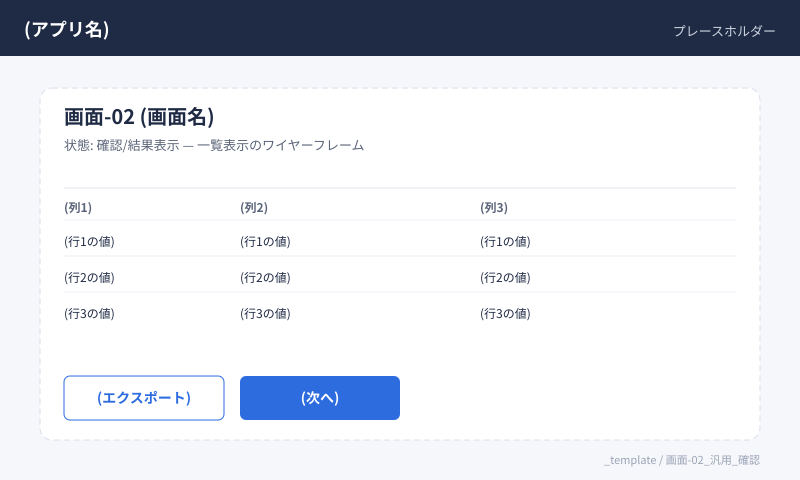

# Webアプリ要求仕様書テンプレート

## ID凡例とプレフィックス

| プレフィックス | 日本語名 | 説明 |
| --- | --- | --- |
| `業務-XX` | 業務要求 | 達成したいビジネス状態・目的 |
| `利用-XX` | 利用要求(ユースケース) | 利用者が行いたい行動・シナリオ |
| `機能-XX` | 機能要求 | 条件成立時のシステム動作 |
| `非機能-XX` | 非機能要求 | 性能・可用性・セキュリティ等の品質属性 |
| `制約-XX` | 制約条件 | 守るべき制限(法令・技術・契約など) |
| `連携-XX` | 外部連携要求 | 外部システム・API・ファイル連携 |
| `前提-XX` | 前提・依存 | 前提条件と外部依存タスク |
| `未解決-XX` | 未解決事項 | 本文に書かず切り出した未確定事項 |
| `データ-XX` | データ要求 | データ項目・整合性・保持・マスタ参照 |
| `画面-XX` | 画面要求 | 画面イメージ・主要要素・遷移条件 |
| `権限-XX` | 役割・権限 | 役割ごとに許可・拒否する操作 |
| `文言-XX` | 画面文言 | 画面に表示するエラー・確認・完了・注意の文言 |
| `リスク-XX` | リスク | 影響度・発生確率と対応方針 |
| `試験-XX` | 試験(テストケース) | 受け入れ基準を検証するテストケース |

**優先度**: `必須` / `推奨` / `任意`  
**ドキュメントID**: `要件-XXXX` 形式で付番する。

---

## 記入の流れ(参照図)


```mermaid
flowchart TD
  docControl["ドキュメント管理"] --> projectOverview["1. プロジェクト概要"]
  projectOverview --> stakeholderAnalysis["2. ステークホルダー分析"]
  stakeholderAnalysis --> businessReq["3. 業務要求"]
  businessReq --> userCases["4. 利用要求"]
  userCases --> roles["5. 役割・権限"]
  roles --> functionalReq["6. 機能要求"]
  functionalReq --> uiRequirements["7. 画面要求"]
  uiRequirements --> messages["8. 画面文言"]
  messages --> nonFunctionalReq["9. 非機能要求"]
  nonFunctionalReq --> constraints["10. 制約条件"]
  constraints --> interfaces["11. 外部連携要求"]
  interfaces --> assumptions["12. 前提・依存"]
  assumptions --> openIssues["13. 未解決事項"]
  openIssues --> tests["14. 試験"]
  tests --> traceability["15. トレーサビリティ"]
  traceability --> dataReq["16. データ要求"]
  dataReq --> risks["17. リスク"]
  risks --> glossary["18. 用語定義"]
```

## レビュー運用シーケンス(参照図)


```mermaid
sequenceDiagram
  actor Author as 作成者
  actor Reviewer as レビュアー
  actor Approver as 承認者
  participant Spec as 要求仕様書
  participant OpenIssues as 未解決一覧

  Author->>Spec: 初版を作成
  Reviewer->>Spec: 業務/利用/機能/非機能をレビュー
  Reviewer-->>Author: 修正コメント
  Author->>OpenIssues: 未確定事項を登録
  Author->>Spec: 修正反映版を更新
  Approver->>Spec: 最終確認
  Approver-->>Author: 承認/差戻し
```

## ドキュメント管理

| 項目 | 値 |
| --- | --- |
| ドキュメントID | 要件-XXXX |
| バージョン | 0.1.0 |
| ステータス | 草案 / レビュー中 / 承認済 |
| 作成日 | YYYY-MM-DD |
| 最終更新日 | YYYY-MM-DD |
| 作成者 | |
| 承認者(顧客側) | |
| 関連資料 | |

---

## 1. プロジェクト概要

### 1.1 目的(Why)

- 例: 受注入力の手作業ミスを削減し、業務担当者が本来業務に集中できる状態を実現する

### 1.2 背景・課題

- 現状の業務フロー:
- 課題:
- 課題によるビジネス影響:

### 1.3 スコープ

#### スコープ内

- [ ]
- [ ]

#### スコープ外

- [ ]
- [ ]

### 1.4 成功指標(KPI)

| 指標カテゴリ | 指標 | 目標値 | 測定条件 | 測定方法 |
| --- | --- | --- | --- | --- |
| 品質 | | | | |
| 速度 | | | | |
| 期限 | | | | |

---

## 2. ステークホルダー分析

| 役割 | 担当者/組織 | 関心事 | 意思決定権 | 備考 |
| --- | --- | --- | --- | --- |
| 顧客責任者 | | | 高 / 中 / 低 | |
| プロダクトマネージャー(PM)/プロダクトオーナー(PO) | | | 高 / 中 / 低 | |
| 開発チーム | | | 高 / 中 / 低 | |
| 運用担当 | | | 高 / 中 / 低 | |

---

## 3. 業務要求

| ID | 業務要求 | 根拠/背景 | 優先度 | 成功判定 |
| --- | --- | --- | --- | --- |
| 業務-01 | | | 必須 / 推奨 / 任意 | |
| 業務-02 | | | 必須 / 推奨 / 任意 | |

---

## 4. 利用要求・ユースケース

| ID | 対象ユーザー | 目的 | トリガー | 期待結果 |
| --- | --- | --- | --- | --- |
| 利用-01 | | | | |
| 利用-02 | | | | |

---

## 5. 役割・権限

役割ごとに、どの対象へのどの操作を許可するかを書く。機能要求の備考から `権限-XX` を参照する。

- 未ログインの利用者も「ゲスト」などの役割として1行以上書く
- 表に無い組み合わせは拒否とみなす
- 画面を表示できるかではなく、操作とデータに対する可否を書く(画面を隠しても API は呼べるため)

| ID | 役割 | 対象 | 操作 | 可否 | 条件 |
| --- | --- | --- | --- | --- | --- |
| 権限-01 | | | 参照 / 作成 / 更新 / 削除 / 実行 | 許可 / 拒否 | |
| 権限-02 | | | 参照 / 作成 / 更新 / 削除 / 実行 | 許可 / 拒否 | |

---

## 6. 機能要求

### 記述ルール

- 推奨形式: 「[条件/トリガー] のとき、システムは [動作] する」
- あいまい語(なるべく、適切に、可能な限り)を避ける
- 実装手段ではなく期待するシステム動作を書く

### 機能要求一覧

| ID | 関連利用 | 機能要求 | 優先度 | 備考 |
| --- | --- | --- | --- | --- |
| 機能-01 | 利用-01 | | 必須 / 推奨 / 任意 | |
| 機能-02 | 利用-01 | | 必須 / 推奨 / 任意 | |

### 6.x 受け入れ基準(各機能に対して記入)

チェックリスト(条件・入力・期待結果・異常系・境界値)に加え、必要に応じて **Given-When-Then** で補足する。

Given-When-Then の例:

```text
Given  有効なユーザーアカウントが存在する
When   ユーザーが正しいIDとパスワードでログインを試みる
Then   システムはダッシュボードへ遷移し、最終ログイン日時を更新する
```

#### 機能-01 受け入れ基準

- [ ] 条件:
- [ ] 入力:
- [ ] 期待結果:
- [ ] 異常系:
- [ ] 境界値:
- [ ] Given-When-Then(任意):

#### 機能-02 受け入れ基準

- [ ] 条件:
- [ ] 入力:
- [ ] 期待結果:
- [ ] 異常系:
- [ ] 境界値:
- [ ] Given-When-Then(任意):

---

## 7. 画面要求(UIイメージ)

### 記述ルール

- キャプチャまたはモックアップは `assets/screens/<プロジェクト識別子>/` に格納する(複数プロジェクトでIDが衝突しないよう、サブディレクトリで名前空間を分ける)
- ファイル名は `画面-ID_画面名_状態.<拡張子>` で統一する(推奨: `.png` / `.svg`)
- 画像には必ず代替テキストを付ける(``)
- 1画像 = 1画面 × 1状態 を原則とする(初期/入力済/エラー など)
- 実データのキャプチャは氏名・メール・金額などをマスクする
- 未確定の画面は `未解決-XX` に登録し、担当者と期限を明記する
- 主要要素は「要素: [DADS のコンポーネント名](https://design.digital.go.jp/dads/components/)」の形で書く。DADS に無い要素は「独自」と書き、理由を添える

### 7.1 画面要求一覧

| ID | 画面名 | 関連利用 | 関連機能 | 主目的 | 備考 |
| --- | --- | --- | --- | --- | --- |
| 画面-01 | | 利用-XX | 機能-XX | | |
| 画面-02 | | 利用-XX | 機能-XX | | |

### 7.2 画面遷移

画面-XX 同士の遷移を図にする。矢印のラベルには遷移の条件を書く。ダイアログなど同じ画面内の状態変化は、画面詳細の「状態」に書く。


```mermaid
flowchart LR
  screen01["画面-01 (画面名)"] -->|"正常時"| screen02["画面-02 (画面名)"]
  screen01 -->|"入力エラー"| screen01
```

### 7.3 画面詳細(各画面に対して記入)

#### 画面-01 (画面名)



> プロジェクトで利用する際は、上記の参照先を `assets/screens/<プロジェクト識別子>/画面-01_<画面名>_<状態>.png` に差し替えてください。`template.md` だけをコピーすると `assets/screens/_template/` への参照が切れるので、画像ディレクトリも一緒にコピーするか、自プロジェクトの画像に差し替えてください。

- 状態: 初期表示 / 入力済 / エラー など
- 主要要素(要素: DADS コンポーネント):
  - (例: 有効期限の入力: 日付ピッカー／カレンダー)
  - (例: 「発行」: ボタン)
- 遷移:
  - 正常時 → (遷移先画面または画面-XX)
  - 異常時 → (エラーメッセージ・遷移先)
- 関連受け入れ基準: 機能-XX

#### 画面-02 (画面名)



- 状態:
- 主要要素(要素: DADS コンポーネント):
- 遷移:
- 関連受け入れ基準:

---

## 8. 画面文言

画面に表示するエラー・確認・完了・注意の文言を一覧にする。受け入れ基準の異常系や画面詳細からは `文言-XX` で参照する。

- 何が起きたかと、利用者が次に何をすればよいかを書く
- 内部のエラーコードや例外メッセージだけを表示しない
- 差し込む値は `{件数}` のように波括弧で書く
- 同じ意味の文言は1つにまとめ、複数の画面から同じ `文言-XX` を参照する

| ID | 種別 | 文言 | 表示条件 | 表示箇所 | 関連機能 |
| --- | --- | --- | --- | --- | --- |
| 文言-01 | エラー / 確認 / 完了 / 注意 | | | 画面-XX | 機能-XX |
| 文言-02 | エラー / 確認 / 完了 / 注意 | | | 画面-XX | 機能-XX |

---

## 9. 非機能要求

分類は [ISO/IEC 25010:2023](https://www.iso.org/standard/78176.html) の製品品質モデルを参考にし、必要に応じて行を追加する。一致対応の日本産業規格は JIS X 25010:2025 である。

JIS X 25010:2025 のまえがきにある、2013年版からの主な変更は次のとおりです。

- 品質特性に「安全性」が追加された(副特性に運用制約性、リスク識別性、フェールセーフ、危険警告性、統合時安全性)
- 「使用性」は「インタラクション容易性(対話性)」に置き換わった
- 「移植性」は「柔軟性」に置き換わった

特性名の例: 機能適合性、性能効率性、互換性、インタラクション容易性(対話性)、信頼性、セキュリティ、保守性、柔軟性、安全性。

| ID | 分類 | 要求 | 目標値 | 測定条件 | 測定方法 |
| --- | --- | --- | --- | --- | --- |
| 非機能-01 | 性能効率性 | | | | |
| 非機能-02 | 信頼性 | | | | |
| 非機能-03 | セキュリティ | | | | |
| 非機能-04 | 保守性 | | | | |
| 非機能-05 | インタラクション容易性 | アクセシビリティ: JIS X 8341-3:2016 に適合する | 適合レベル AA | 対象: 全画面 / 画面-XX | 達成基準ごとの試験と、スクリーンリーダーでの操作確認 |
| 非機能-06 | 互換性 | 対応環境: ブラウザ・OS・画面幅 | (例: 主要ブラウザの最新版と1つ前、画面幅 320px 以上) | 対象: 全画面 / 画面-XX | 対応環境ごとの表示と操作の確認 |

アクセシビリティ(非機能-05)と対応環境(非機能-06)は、Webアプリでは必ず書く。[DADS はアクセシビリティに配慮して作られている](https://design.digital.go.jp/dads/guidance/accessibility/)が、DADS のコンポーネントを使うだけでは適合にならない。目標とする適合レベル、対象の範囲、試験方法をこの表で決める。

---

## 10. 制約条件

| ID | 制約内容 | 理由 | 影響範囲 |
| --- | --- | --- | --- |
| 制約-01 | 画面はデジタル庁デザインシステム(DADS) vX.Y.Z に準拠する。デザイントークンは `@digital-go-jp/design-tokens` X.Y.Z を使う | 画面設計とアクセシビリティの基準をそろえる | フロントエンド全体 |
| 制約-02 | | | |

DADS はリビングスタンダードとして版が上がり続けるため、準拠する版を制約条件で固定する。サイトの版とデザイントークンのパッケージの版は別の番号なので、両方を書く。Tailwind CSS を使う場合は `@digital-go-jp/tailwind-theme-plugin` の版も書く。版を上げるときはこの行を更新し、変更履歴に残す。

---

## 11. 外部連携要求

| ID | 連携先 | インターフェース | データ形式 | 入出力 | 備考 |
| --- | --- | --- | --- | --- | --- |
| 連携-01 | | API / ファイル / DB / メッセージ | JSON / CSV / XML | 入力 / 出力 | |
| 連携-02 | | API / ファイル / DB / メッセージ | JSON / CSV / XML | 入力 / 出力 | |

---

## 12. 前提条件・依存関係

| ID | 前提/依存 | 内容 | 担当 | 期限 | 状態 |
| --- | --- | --- | --- | --- | --- |
| 前提-01 | 前提条件 | | | YYYY-MM-DD | 未着手 / 進行中 / 完了 |
| 前提-02 | 依存関係 | | | YYYY-MM-DD | 未着手 / 進行中 / 完了 |

---

## 13. 未解決事項

| ID | 未解決事項 | 担当者 | 期限 | 状態 | 関連ID |
| --- | --- | --- | --- | --- | --- |
| 未解決-01 | | | YYYY-MM-DD | 未解決 / 解決済 | 機能-XX |
| 未解決-02 | | | YYYY-MM-DD | 未解決 / 解決済 | 非機能-XX |

---

## 14. 試験

受け入れ基準と非機能要求を検証する試験を一覧にする。トレーサビリティ表の `試験` 列には、この表で定義した `試験-XX` だけを書く。

| ID | 対象 | 検証する観点 | 手順 | 期待結果 | 種別 |
| --- | --- | --- | --- | --- | --- |
| 試験-01 | 機能-XX | 条件 / 異常系 / 境界値 など | | | 手動 / E2E / 単体 |
| 試験-02 | 非機能-XX | | | | 手動 / E2E / 単体 |

---

## 15. トレーサビリティ

業務から試験までの対応を一覧化する(行は必要数だけ追加)。

| 業務 | 利用 | 機能 | 画面 | 非機能 | データ | 試験 |
| --- | --- | --- | --- | --- | --- | --- |
| 業務-01 | 利用-01 | 機能-01 | 画面-01 | 非機能-01 | データ-01 | 試験-01 |
| | | | | | | |

---

## 16. データ要求

個人情報を含むデータは `個人情報` 列に区分を書き、保持期間と保持期間後の扱い(削除 / 匿名化)を必ず書く。利用目的や同意の取り方は `制約-XX` に書く。

| ID | データ/エンティティ | 項目・制約 | 個人情報 | 整合性 | 保持期間 | 備考 |
| --- | --- | --- | --- | --- | --- | --- |
| データ-01 | | | 含まない / 個人情報 / 要配慮個人情報 | | | |
| データ-02 | | | 含まない / 個人情報 / 要配慮個人情報 | | | |

---

## 17. リスク

| ID | リスク内容 | 発生確率 | 影響度 | 対応方針 | 関連ID |
| --- | --- | --- | --- | --- | --- |
| リスク-01 | | 低/中/高 | 低/中/高 | 回避/軽減/受容/転嫁 | |
| リスク-02 | | 低/中/高 | 低/中/高 | 回避/軽減/受容/転嫁 | |

---

## 18. 用語定義

| 用語 | 定義 | 備考 |
| --- | --- | --- |
| | | |
| | | |

---

## 変更履歴

| バージョン | 日付 | 変更内容 | 変更者 |
| --- | --- | --- | --- |
| 0.1.0 | YYYY-MM-DD | 初版作成 | |
